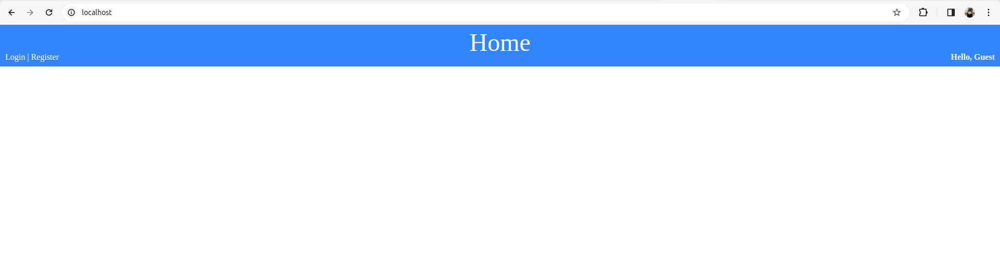

## Web Form - Login

This is a Web application build on PHP 8.3.3. It's dockerized and for database uses a MySQL 8.0.36 and for server uses Nginx 1.25.3.
All dependencies are part of the Docker setup which you can find as part of the project. Keep in mind when you run Docker
setup it'll creates a Database named '<b>wf_login</b>'.

### Prerequisites

1. Docker - Can be downloaded/installed from the official [Docker page](https://docs.docker.com/get-docker/)

### Setup

To install the project locally type the following commands in your terminal:

```shell
git clone https://github.com/seeff00/wf-login.git
cd wf-login
mv .env.dev .env
docker-compose up -d
```

### Usage

Open your favorite browser and enter '<b>localhost</b>' in the URL field.

